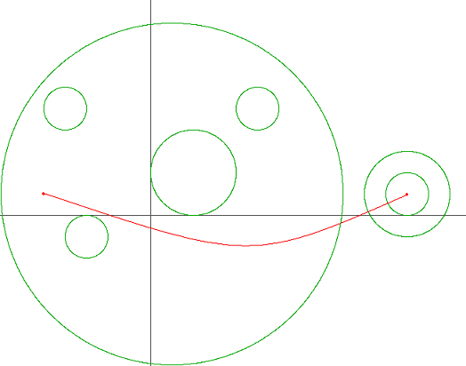

# [Silver III] 어린 왕자 - 1004

[문제 링크](https://www.acmicpc.net/problem/1004)

### 성능 요약

메모리: 11568 KB, 시간: 72 ms

### 분류

수학, 기하학

### 제출 일자

2024년 7월 12일 15:38:11

### 문제 설명

어린 왕자는 소혹성 B-664에서 자신이 사랑하는 한 송이 장미를 위해 살아간다. 어느 날 장미가 위험에 빠지게 된 것을 알게 된 어린 왕자는, 장미를 구하기 위해 은하수를 따라 긴 여행을 하기 시작했다. 하지만 어린 왕자의 우주선은 그렇게 좋지 않아서 행성계 간의 이동을 최대한 피해서 여행해야 한다. 아래의 그림은 어린 왕자가 펼쳐본 은하수 지도의 일부이다.

빨간 실선은 어린 왕자가 출발점에서 도착점까지 도달하는데 있어서 필요한 행성계 진입/이탈 횟수를 최소화하는 경로이며, 원은 행성계의 경계를 의미한다. 이러한 경로는 여러 개 존재할
수 있지만 적어도 3번의 행성계 진입/이탈이 필요하다는 것을 알 수 있다.

위와 같은 은하수 지도, 출발점, 도착점이 주어졌을 때 어린 왕자에게 필요한 최소의 행성계 진입/이탈 횟수를 구하는 프로그램을 작성해 보자. 행성계의 경계가 맞닿거나 서로 교차하는
경우는 없다. 또한, 출발점이나 도착점이 행성계 경계에 걸쳐진 경우 역시 입력으로 주어지지 않는다.

### 입력

 
입력의 첫 줄에는 테스트 케이스의 개수 T가 주어진다. 그 다음 줄부터 각각의 테스트케이스에 대해 첫째 줄에 출발점 (x1, y1)과 도착점 (x2, y2)이 주어진다. 두 번째 줄에는 행성계의 개수 n이 주어지며, 세 번째 줄부터 n줄에 걸쳐 행성계의 중점과 반지름 (cx, cy, r)이 주어진다.

### 출력

 
각 테스트 케이스에 대해 어린 왕자가 거쳐야 할 최소의 행성계 진입/이탈 횟수를 출력한다.

### 제한

- -1000 ≤ x1, y1, x2, y2, cx, cy ≤ 1000
- 1 ≤ r ≤ 1000
- 1 ≤ n ≤ 50
- 좌표와 반지름은 모두 정수

				

					

						<section id="sampleinput1">
						

						<h2>예제 입력 1
							<button type="button" class="btn btn-link copy-button" style="padding: 0px;" data-clipboard-target="#sample-input-1">복사</button>
						</h2>
						

						<pre class="sampledata" id="sample-input-1">2
-5 1 12 1
7
1 1 8
-3 -1 1
2 2 2
5 5 1
-4 5 1
12 1 1
12 1 2
-5 1 5 1
1
0 0 2
</pre>
						</section>
					

						<section id="sampleoutput1">
						

						<h2>예제 출력 1
							<button type="button" class="btn btn-link copy-button" style="padding: 0px;" data-clipboard-target="#sample-output-1">복사</button>
						</h2>
						

						<pre class="sampledata" id="sample-output-1">3
0
</pre>
						</section>
					

									

				

								

				

					

						<section id="sampleinput2">
						

						<h2>예제 입력 2
							<button type="button" class="btn btn-link copy-button" style="padding: 0px;" data-clipboard-target="#sample-input-2">복사</button>
						</h2>
						

						<pre class="sampledata" id="sample-input-2">3
-5 1 5 1
3
0 0 2
-6 1 2
6 2 2
2 3 13 2
8
-3 -1 1
2 2 3
2 3 1
0 1 7
-4 5 1
12 1 1
12 1 2
12 1 3
102 16 19 -108
12
-107 175 135
-38 -115 42
140 23 70
148 -2 39
-198 -49 89
172 -151 39
-179 -52 43
148 42 150
176 0 10
153 68 120
-56 109 16
-187 -174 8
</pre>
						</section>
					

					

						<section id="sampleoutput2">
						

						<h2>예제 출력 2
							<button type="button" class="btn btn-link copy-button" style="padding: 0px;" data-clipboard-target="#sample-output-2">복사</button>
						</h2>
						

						<pre class="sampledata" id="sample-output-2">2
5
3
</pre>
						</section>
					

									

				

										

				<section id="hint" style="display: none;" class="problem-section">
				

				<h2>힌트</h2>
				

				

				

				</section>
			

								

									
<section id="source">
<h2>출처</h2>
<ul><li>문제를 번역한 사람:&nbsp;<a href="/user/AIAI">AIAI</a></li><li>문제의 오타를 찾은 사람:&nbsp;<a href="/user/imgosari">imgosari</a>, <a href="/user/jenny00513">jenny00513</a>, <a href="/user/jh05013">jh05013</a>, <a href="/user/lentti">lentti</a>, <a href="/user/rdd6584">rdd6584</a></li><li>잘못된 번역을 찾은 사람:&nbsp;<a href="/user/ntopia">ntopia</a></li></ul></section>

													

					<section id="problem_tags">
					

					<h2>알고리즘 분류</h2>
					

																															

<a href="#" class="show-spoiler">보기</a>

					

  					<ul class="spoiler-list">
  						  							<li>
  							<a href="/problem/tag/124" class="spoiler-link">수학</a>
  							</li>
  						  							<li>
  							<a href="/problem/tag/100" class="spoiler-link">기하학</a>
  							</li>
  						  					</ul>
					

										</section>
				
